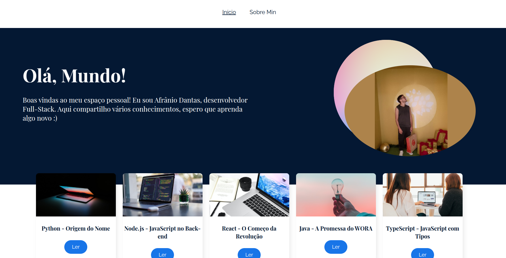

## About Me

Esse projeto tem como objetivo falar sobre minha pessoa quanto desenvolvedor além de disponibilizar conteudos sobre áreas da programação.

SPA - Single Page Aplication
Router Dom

O site está disponível em:

```bash
https://about-me-one-azure.vercel.app/
```

## 📝 Como executar o projeto na sua máquina?

1. Clone o repositório:

   ```bash
   git clone https://github.com/Marvinx9/about-me.git

   cd about-me
   ```

2. Instale as dependências

   ```bash
   npm install
   ```

3. Inicie o servidor de desenvolvimento

   ```
   npm start
   ```

### tela


